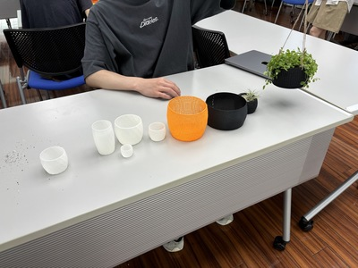

# SFCデジタルファブリケーション 制作物

[デジタルファブリケーション 【学期後半】](https://syllabus.sfc.keio.ac.jp/courses/2024_25219)にて制作した植木鉢のSTLやGCodeを公開することを目的とする。

> [!WARNING]
> week5, week7のGCode実行は3Dプリンタ破壊する可能性があります。
> 印刷後3~5層程度は目を離さず印刷を実行してください。
> 実行ターゲットはEnder5 S1です。

## 制作物一覧

| 項目  | 画像  |
| ----- | ----- |
|[week0 履修選抜課題](./assets/week0) ||
|[week1 Nodi3Dによるサイズ変更](./assets/week1)| |
|[week3 Gyroid](./assets/week3/)| |
|[week4 テクスチャによる積層面の隠蔽](./assets//week4/)||
|[week5 太ノズルによる印刷](./assets/week5/) ||
|[week7 最終発表](./assets/week7/) ||
